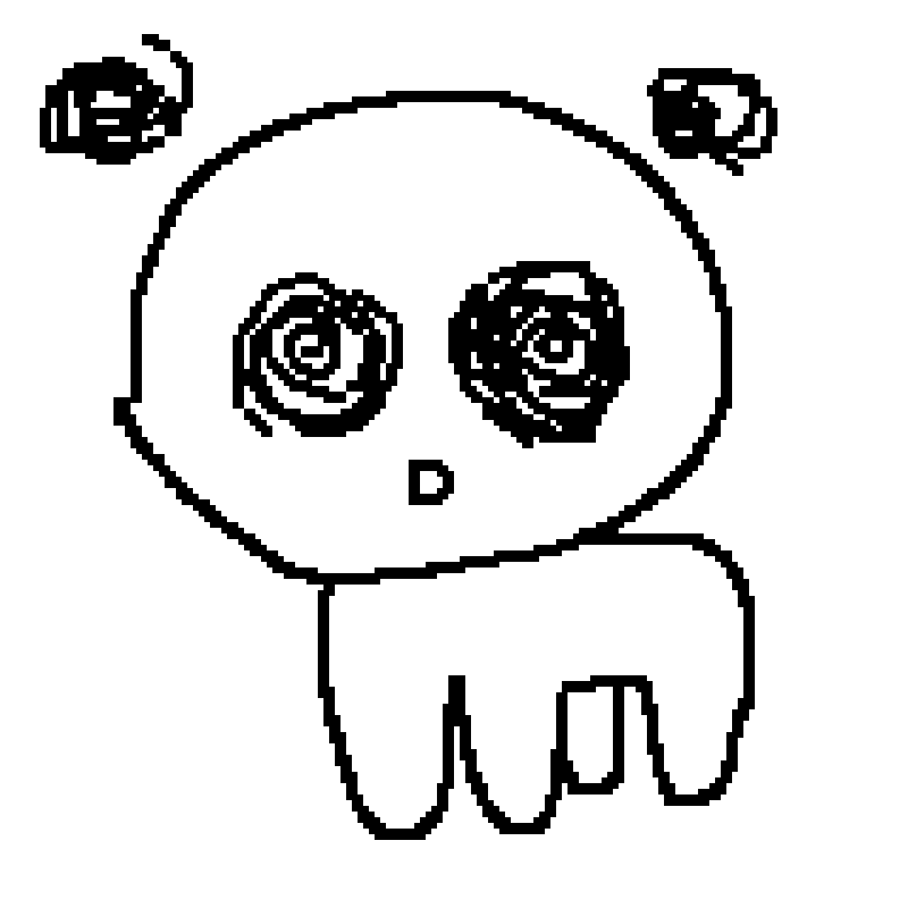
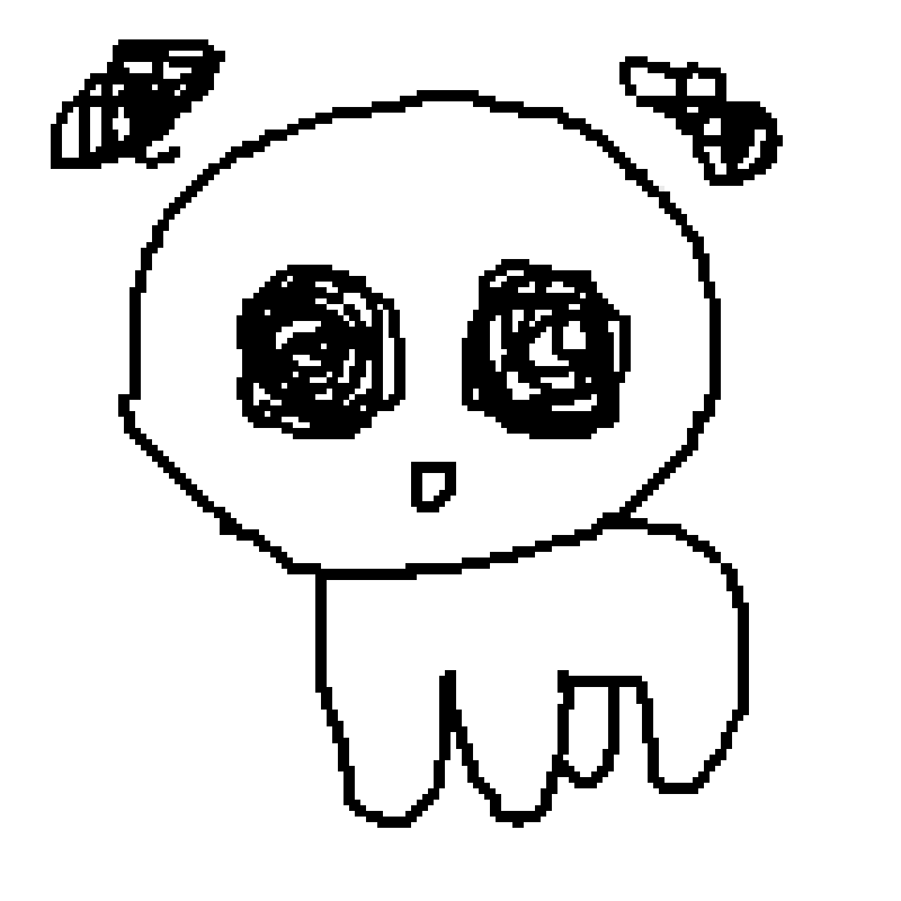
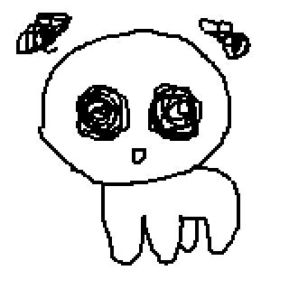

# **Sprite Design Guide**

### To ensure consistency between art assets, the following guidelines should be followed when creating sprites.

- Sprites are drawn using a `2px` wide square brush.
- In Godot the texture filter of a `Sprite2D` using a sprite is set to `Nearest` to maintain sharp pixels.
- To give otherwise static sprites life, at least `3 frames` of animation (2 additional frames) should be made by tracing over the previous frame.

> 
> 
> 
>

***

> ### For reference the dimensions of the standard Creature are:
> - Height: `132px`.
> - Width: `112px`.
