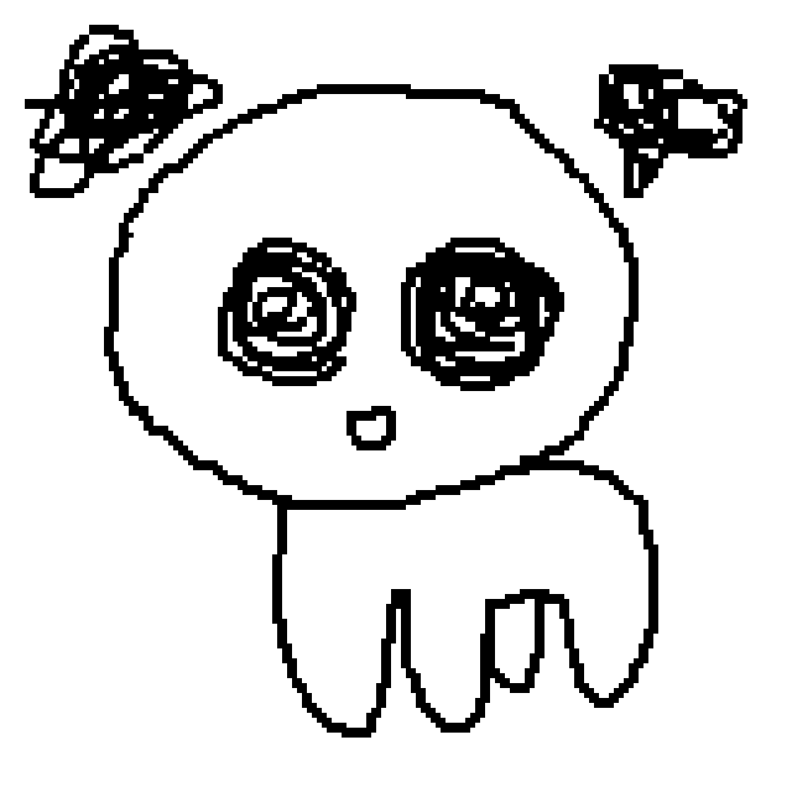

# **Sprite Design Guide**

### To ensure consistency between art assets, the following guidelines should be followed when creating sprites.

- Sprites are drawn using a `2px` wide square brush with `100%` spacing.
- Sprites should be no larger than `240px by 240px` to remain within the visible area.

  
> [!NOTE] 
>  **For reference the dimensions of the standard Creature are:**
> - Height: `132px`.
> - Width: `112px`. 
- The animation frame rate of sprites is set to `4 FPS`.
- To give otherwise static sprites life, at least `3 frames` of animation (2 additional frames) should be made by tracing over the previous frame.

- In Godot the texture filter of a `Sprite2D` using a sprite is set to `Nearest` to maintain sharp pixels.
- Sprites are scaled in game to a factor of `1.8x`.