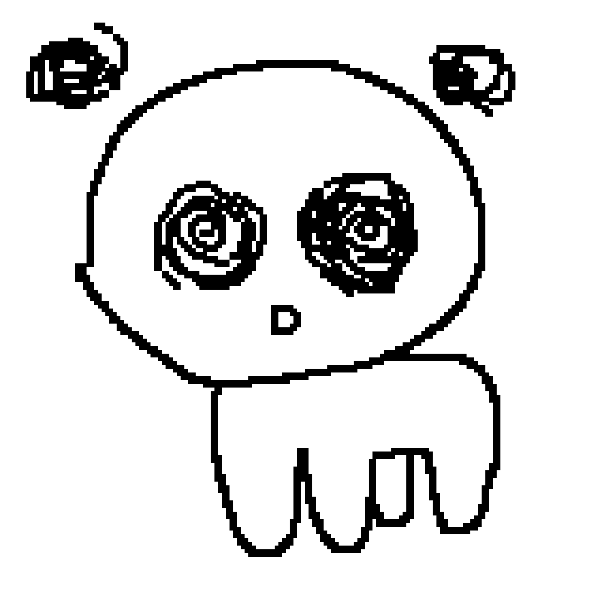
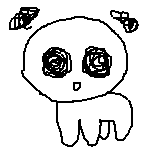

# **Sprite Design Guide**

### To ensure consistency between sprite assets, the following guidelines should be followed when creating sprites.
 

## **Creating Sprites**

- Sprites are drawn using a `2px` wide square brush with `100%` spacing.
- Sprites should be no larger than `240px by 240px` if they wish to remain within the visible area.

  
> [!NOTE] 
>  **For reference the dimensions of the standard Creature are:**
> - Height: `132px`, Width: `112px`.

## **Adding Animation (line-boil)**

- To give static sprites more character, `2` additional frames (`3 frames` in total) should be created by tracing over the previous frame.
  (See example below)

## **Using sprites in Godot** 

- The `texture filtering` of the `AnimatedSprite2D` containing the sprite is set to `Nearest` to maintain sharp pixels.
- Sprites are scaled by a factor of `1.8x`.
- The framerate of animations are set to `4 FPS`.